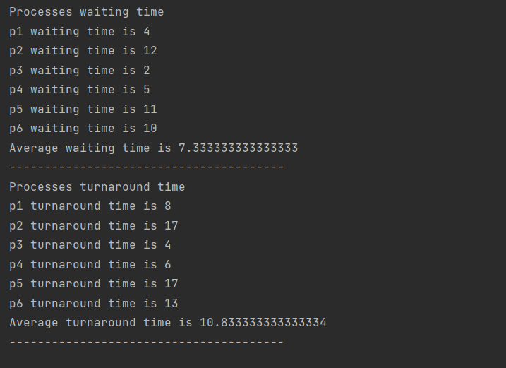

# This i a java program that simulates 4 scheduling algorithims

## Input
- number of processes
- each process in this form (proccess-name priority arrival-time execution-time quantum-time)
- context switching time
- quantum time in case of round robing scheduling

## output
- a complete timeline of the processes execution
- the wating time for each proccess and their average
- the turnaround time for each process and their average
- the quantum time history in case of ag scheduling

## shortest remianing time scheduling algorithm input output example

## round robin scheduling algorithm input output example

## preemptive priority scheduling algorithm input output example

## AG scheduling algorithm input output example

